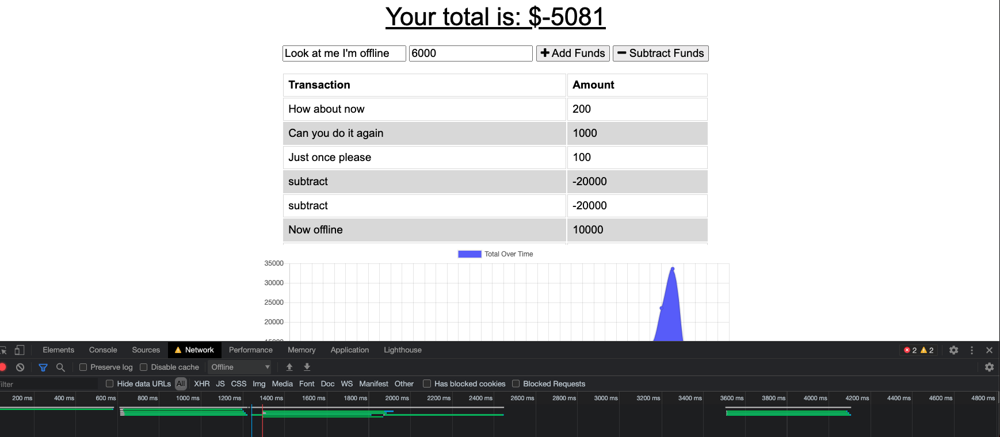
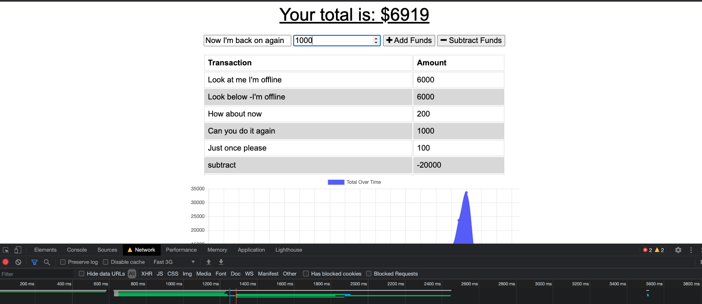

# budget-tracker-offline

Online/Offline Budget Tracker

## Description

This is a budget tracking progressive web application that saves the users entry when they return online

## Table of Contents

- [Installation](#installation)
- [Usage](#usage)
- [Contributing](#contributing)
- [Tests](#tests)
- [Questions](#questions)
- [License](#license)

## Installation

This project is deployed to heroku and can be used from the deployed site.
[Repo](https://github.com/jasdjames/budget-tracker-offline)
[Deployed](https://radiant-forest-84432.herokuapp.com/)

## Usage

The user may add items to their budget that may add or subtract funds. The amount is then added or subtracted from their total budget. When the user loses connectivity they may still add the and subtract items that will be added successfully when their connection returns

## Contributing

Contribution is open to all. As always, I worked collaboratively with my classmates, instructor, and tutor. I also utilized the resources provided, and searched online for any gaps in knowledge.

## Tests

No tests were required

## Questions

Please contact me via GitHub or email for contributions
[jasdjames]
(https://github.com/jasdjames)
jasdjames@gmail.com

## License

MIT
MIT License

    Copyright (c) [2021] [JasDJames]

    Permission is hereby granted, free of charge, to any person obtaining a copy
    of this software and associated documentation files (the "Software"), to deal
    in the Software without restriction, including without limitation the rights
    to use, copy, modify, merge, publish, distribute, sublicense, and/or sell
    copies of the Software, and to permit persons to whom the Software is
    furnished to do so, subject to the following conditions:

    The above copyright notice and this permission notice shall be included in all
    copies or substantial portions of the Software.

    THE SOFTWARE IS PROVIDED "AS IS", WITHOUT WARRANTY OF ANY KIND, EXPRESS OR
    IMPLIED, INCLUDING BUT NOT LIMITED TO THE WARRANTIES OF MERCHANTABILITY,
    FITNESS FOR A PARTICULAR PURPOSE AND NONINFRINGEMENT. IN NO EVENT SHALL THE
    AUTHORS OR COPYRIGHT HOLDERS BE LIABLE FOR ANY CLAIM, DAMAGES OR OTHER
    LIABILITY, WHETHER IN AN ACTION OF CONTRACT, TORT OR OTHERWISE, ARISING FROM,
    OUT OF OR IN CONNECTION WITH THE SOFTWARE OR THE USE OR OTHER DEALINGS IN THE
    SOFTWARE.
